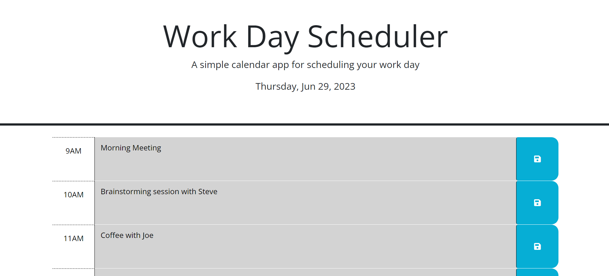

# work-day-scheduler

For the fifth weekly challenge, my task was to modify starter code using jQuery, in order to create an application that has the functionality of a daily planner. The work day scheduler should have the following features: it should dynamically populate the time-blocks for usual business hours of 9AM to 5PM; use color coding to show whether a given time block is in the past, present, or future; be able to show the current date at the top of the page; and on save-button click, the application should be able to save the event data for the respective time block to local storage, in order for it to persist on page refresh.

The HTML and CSS files were provided as starter code and were only modified to remove the static examples of time blocks, and to insert an id attribute for the schedule container. The JavaScript/jQuery code for the application, as shown below, was of my own design.

## Associated links:

Repo:
https://github.com/higgdan/work-day-scheduler

Application:
https://higgdan.github.io/work-day-scheduler/
